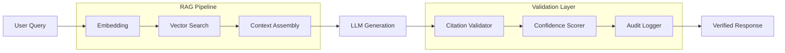

# 🤖 Vetted Legal AI Engine

**Fix the reliability gap.**

[](LICENSE)

[](CONTRIBUTING.md)
[](https://github.com/dougdevitre/vetted-legal-ai/pulls)

---

## The Problem

General-purpose AI models hallucinate legal citations, fabricate case law, and produce unreliable advice. When an attorney submits a brief with fake citations, courts sanction them. When a self-represented litigant follows bad AI advice, they lose their case.

The reliability gap in legal AI is not a minor inconvenience — it is a liability risk that undermines trust in the entire system.

## The Solution

A Retrieval-Augmented Generation (RAG) engine purpose-built for legal applications. Every response is grounded in verified legal data. Every citation is validated against its source. Every answer carries a confidence score. Every query leaves a complete audit trail.

This is not a chatbot with a legal skin. It is infrastructure for trustworthy legal AI.

---

## Architecture



---

## Who This Helps

| Audience | How This Helps |
|---|---|
| **Legal aid organizations** | Reliable AI assistance without hallucination risk |
| **Pro bono attorneys** | Research tool they can trust for real case work |
| **Court self-help centers** | Provide accurate, sourced information to litigants |
| **Justice tech platforms** | Embed vetted AI into their applications |

---

## Features

- [ ] RAG pipeline with verified legal corpus
- [ ] Citation validation — every citation checked against source material
- [ ] Confidence scoring per response (high / medium / low / insufficient)
- [ ] Complete audit trail — query, sources, generation, validation logged
- [ ] Jurisdiction-aware retrieval — filter by state, federal, or topic
- [ ] Source transparency — full provenance chain for every answer
- [ ] Pluggable LLM backend (OpenAI, Anthropic, local models)
- [ ] FastAPI-based REST interface

---

## Tech Stack

| Layer | Technology |
|---|---|
| Language | Python 3.11+ |
| RAG Framework | LangChain |
| Vector Store | ChromaDB |
| API | FastAPI |
| Validation | Pydantic |
| Testing | pytest |
| Linting | Ruff + mypy |

---

## Quick Start

```bash
git clone https://github.com/dougdevitre/vetted-legal-ai.git
cd vetted-legal-ai
python -m venv .venv
source .venv/bin/activate
pip install -e ".[dev]"
uvicorn src.vetted_legal_ai.api.routes:app --reload
# API is now running at http://localhost:8000 — see /docs for Swagger UI
```

### Query the RAG Engine

```python
import httpx

response = httpx.post("http://localhost:8000/query", json={
    "question": "What are the grounds for eviction in Missouri?",
    "jurisdiction": "MO",
    "max_sources": 5,
})

result = response.json()
print(result["answer"])
print(f"Confidence: {result['confidence']}")

for cite in result["citations"]:
    print(f"  [{cite['status']}] {cite['case_name']} — {cite['citation']}")
```

> See [examples/basic_query.py](examples/basic_query.py) for a complete working example.

---

## Roadmap

| Feature | Status |
|---------|--------|
| RAG pipeline with ChromaDB vector store | In Progress |
| Citation validation against source corpus | In Progress |
| Confidence scoring per response | Planned |
| Jurisdiction-aware retrieval filtering | Planned |
| Pluggable LLM backend (OpenAI, Anthropic, local) | Planned |
| Complete audit trail with query provenance | Planned |

---

## Justice OS Ecosystem

This repository is part of the **Justice OS** open-source ecosystem — 12 interconnected projects building the infrastructure for accessible justice technology.

| Repository | Description |
|-----------|-------------|
| [justice-os](https://github.com/dougdevitre/justice-os) | Core modular platform — the foundation |
| [mobile-court-access](https://github.com/dougdevitre/mobile-court-access) | Mobile-first court access kit |
| [vetted-legal-ai](https://github.com/dougdevitre/vetted-legal-ai) | RAG engine with citation validation |
| [court-doc-engine](https://github.com/dougdevitre/court-doc-engine) | TurboTax for legal filings |
| [cognitive-load-ui](https://github.com/dougdevitre/cognitive-load-ui) | Design system for stressed users |
| [multilingual-justice](https://github.com/dougdevitre/multilingual-justice) | Real-time legal translation |
| [justice-api-gateway](https://github.com/dougdevitre/justice-api-gateway) | Interoperability layer for courts |
| [justice-analytics](https://github.com/dougdevitre/justice-analytics) | Bias detection and disparity dashboards |
| [evidence-timeline](https://github.com/dougdevitre/evidence-timeline) | Evidence timeline builder |
| [digital-literacy-sim](https://github.com/dougdevitre/digital-literacy-sim) | Digital literacy simulator |
| [pro-se-toolkit](https://github.com/dougdevitre/pro-se-toolkit) | Self-represented litigant tools |
| [justice-components](https://github.com/dougdevitre/justice-components) | Reusable component library |

> Built with purpose. Open by design. Justice for all.

---

## Contributing

See [CONTRIBUTING.md](CONTRIBUTING.md) for guidelines.

## License

MIT — see [LICENSE](LICENSE).
