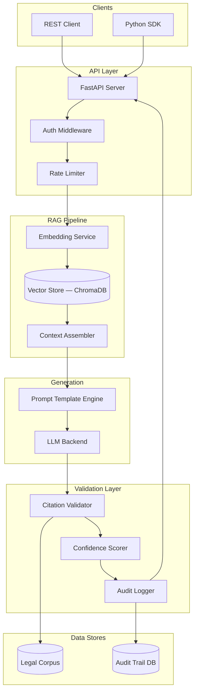
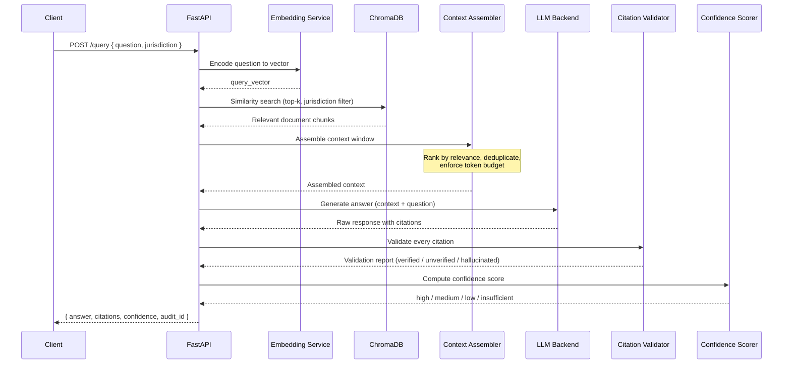
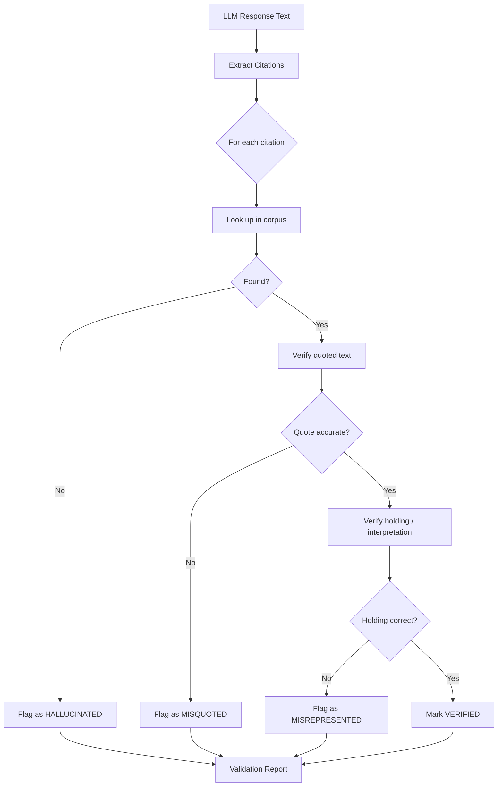
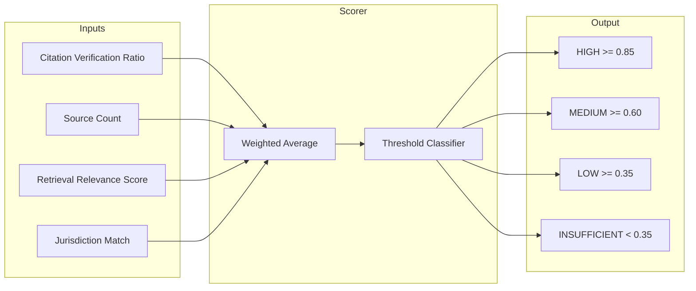

# Architecture — Vetted Legal AI

## System Overview

```mermaid
graph TD
    subgraph Clients
        API_CLIENT[REST Client]
        SDK[Python SDK]
    end

    subgraph API Layer
        FASTAPI[FastAPI Server]
        AUTH[Auth Middleware]
        RATE[Rate Limiter]
    end

    subgraph RAG Pipeline
        EMB[Embedding Service]
        VS[(Vector Store — ChromaDB)]
        CA[Context Assembler]
    end

    subgraph Generation
        LLM[LLM Backend]
        PROMPT[Prompt Template Engine]
    end

    subgraph Validation Layer
        CV[Citation Validator]
        CS[Confidence Scorer]
        AL[Audit Logger]
    end

    subgraph Data Stores
        CORPUS[(Legal Corpus)]
        AUDIT_DB[(Audit Trail DB)]
    end

    API_CLIENT --> FASTAPI
    SDK --> FASTAPI
    FASTAPI --> AUTH
    AUTH --> RATE
    RATE --> EMB
    EMB --> VS
    VS --> CA
    CA --> PROMPT
    PROMPT --> LLM
    LLM --> CV
    CV --> CORPUS
    CV --> CS
    CS --> AL
    AL --> AUDIT_DB
    AL --> FASTAPI
```

## RAG Pipeline Detail

```mermaid
sequenceDiagram
    participant Client
    participant API as FastAPI
    participant Embed as Embedding Service
    participant VDB as ChromaDB
    participant Asm as Context Assembler
    participant LLM as LLM Backend
    participant Val as Citation Validator
    participant Score as Confidence Scorer

    Client->>API: POST /query { question, jurisdiction }
    API->>Embed: Encode question to vector
    Embed-->>API: query_vector

    API->>VDB: Similarity search (top-k, jurisdiction filter)
    VDB-->>API: Relevant document chunks

    API->>Asm: Assemble context window
    Note over Asm: Rank by relevance, deduplicate,<br/>enforce token budget

    Asm-->>API: Assembled context

    API->>LLM: Generate answer (context + question)
    LLM-->>API: Raw response with citations

    API->>Val: Validate every citation
    Val-->>API: Validation report (verified / unverified / hallucinated)

    API->>Score: Compute confidence score
    Score-->>API: high / medium / low / insufficient

    API-->>Client: { answer, citations, confidence, audit_id }
```

## Citation Validation Flow

```mermaid
flowchart TD
    INPUT[LLM Response Text] --> EXTRACT[Extract Citations]
    EXTRACT --> LOOP{For each citation}

    LOOP --> LOOKUP[Look up in corpus]
    LOOKUP --> FOUND{Found?}

    FOUND -->|Yes| QUOTE_CHECK[Verify quoted text]
    FOUND -->|No| FLAG_HALLUCINATED[Flag as HALLUCINATED]

    QUOTE_CHECK --> QUOTE_OK{Quote accurate?}
    QUOTE_OK -->|Yes| HOLDING_CHECK[Verify holding / interpretation]
    QUOTE_OK -->|No| FLAG_MISQUOTED[Flag as MISQUOTED]

    HOLDING_CHECK --> HOLDING_OK{Holding correct?}
    HOLDING_OK -->|Yes| MARK_VERIFIED[Mark VERIFIED]
    HOLDING_OK -->|No| FLAG_MISREPRESENTED[Flag as MISREPRESENTED]

    FLAG_HALLUCINATED --> REPORT
    FLAG_MISQUOTED --> REPORT
    FLAG_MISREPRESENTED --> REPORT
    MARK_VERIFIED --> REPORT

    REPORT[Validation Report]
```

## Confidence Scoring

```mermaid
graph LR
    subgraph Inputs
        CITE_RATIO[Citation Verification Ratio]
        SOURCE_COUNT[Source Count]
        RELEVANCE[Retrieval Relevance Score]
        JURISDICTION[Jurisdiction Match]
    end

    subgraph Scorer
        WEIGHTED[Weighted Average]
        THRESHOLD[Threshold Classifier]
    end

    subgraph Output
        HIGH[HIGH >= 0.85]
        MEDIUM[MEDIUM >= 0.60]
        LOW[LOW >= 0.35]
        INSUFFICIENT[INSUFFICIENT < 0.35]
    end

    CITE_RATIO --> WEIGHTED
    SOURCE_COUNT --> WEIGHTED
    RELEVANCE --> WEIGHTED
    JURISDICTION --> WEIGHTED
    WEIGHTED --> THRESHOLD
    THRESHOLD --> HIGH
    THRESHOLD --> MEDIUM
    THRESHOLD --> LOW
    THRESHOLD --> INSUFFICIENT
```
